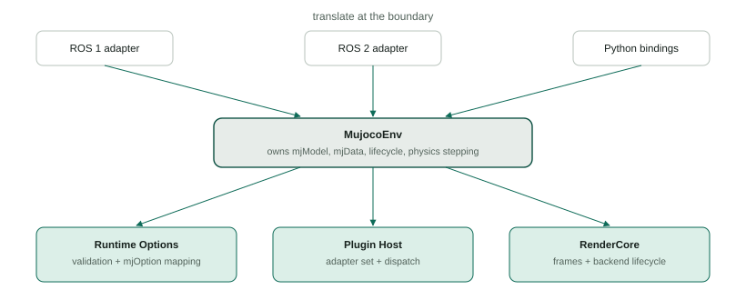
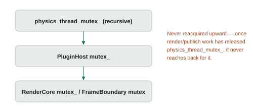

Overview
========

The core server is built around one rule: ``MujocoEnv`` is the only simulation owner. Everything else that used to be entangled with it — runtime option mutation, plugin lifecycle, offscreen rendering — is now a focused module behind a synchronized entry point. None of those modules is allowed to become a second owner of the model, the data, or the simulation lifecycle.

Ownership map
-------------

``MujocoEnv``
  Owns ``mjModel`` and ``mjData``, the simulation lifecycle, physics stepping, model loading and replacement, and the coordination that keeps the other modules in step with all of that.

``Runtime Options`` (``runtime_options.hpp``)
  Owns the typed ``RuntimeOptionsSnapshot``/``RuntimeOptionsPatch`` contract, field validation, and the mapping to and from ``mjOption``. It does not own ``mjModel``, ``mjData``, or a persistent copy of the active options — every read goes back to the live model.

``Plugin Host`` (``plugin_host.hpp``)
  Owns the set of loaded plugin adapters, callback dispatch, reset and geometry notifications, statistics, and reload ordering for that set. It does not own ``mjModel``, ``mjData``, or physics stepping.

``RenderCore`` (``rendering/render_core.hpp``)
  Owns camera descriptors, render-backend lifecycle and thread affinity, copied render snapshots, frame storage and leases, and publication-demand scheduling. It does not own ``MujocoEnv``, ROS nodes, ROS message types, or transport timestamps.

Transport adapters (ROS 1, ROS 2, Python)
  Own parameter/message parsing, pluginlib construction, ROS node setup, and transport-specific timestamps. They translate at the boundary; they do not parse, validate, or mutate core state directly.

   Every transport translates into ``MujocoEnv``, which is the only thing that owns the model and orchestrates the three focused modules below it.

See :doc:`../render_core/render_core`, :doc:`../plugin_host/plugin_host`, and :doc:`../runtime_options/runtime_options` for how each of these actually works.

Generations
-----------

Four independent counters make "which epoch does this belong to" an explicit, checkable value instead of an assumption:

.. code-block:: text

   ModelGeneration    one mjModel/mjData ownership epoch
   PluginGeneration   the adapter set loaded against one ModelGeneration
   FrameGeneration    one render layout/camera configuration
   OptionsEpoch        one successfully applied Runtime Options update

Each is a distinct type (``GenerationId<Tag>`` in ``generation.hpp``), so a ``FrameGeneration`` and a ``PluginGeneration`` cannot be compared or assigned to each other by mistake even though both are, underneath, just an integer. A render turn, a plugin dispatch, and a runtime-option update each carry the generation they were issued against, and every one of those seams rejects a call whose generation no longer matches current state rather than silently acting on stale data.

Lock order
----------

   Fixed acquire order. Code that has released a lower lock never reaches back up the chain for one it already left.

In particular, once render or publication work has released ``physics_thread_mutex_`` (see :doc:`../render_core/render_core`), it never reacquires it while waiting on the render thread, a backend call, or a subscriber.

Reload touches all three modules, in this order
------------------------------------------------

A model reload is the one operation that has to coordinate ``PluginHost`` and ``RenderCore`` together under ``MujocoEnv``. At a glance:

.. code-block:: text

   1. physics_thread_mutex_ acquired
   2. PluginHost::QuiesceAndDestroy()      -- old adapters gone
   3. RenderCore stops admission, cancels the current/queued render turn
   4. physics_thread_mutex_ released while RenderCore settles and any
      already-admitted render turn drains its unlocked publish tail
   5. old cameras detached from the retiring RenderCore
   6. physics_thread_mutex_ re-acquired; model/data swap; ModelGeneration++
   7. mj_forward() -- no plugin adapters exist yet, so no callbacks fire
   8. pending startup Runtime Options apply as one transaction (if any)
   9. new PluginGeneration loads and activates
   10. outside the physics lock: RenderCore reconfigures for the new
       model -- new FrameGeneration, cameras rebound, Python consumers
       rebound

The callback-free window is not incidental: it stops an old plugin instance from ever observing the new model/data pair. :doc:`../plugin_host/plugin_host` covers why that window exists and how it is enforced. :doc:`../render_core/render_core` covers the corresponding render-core lifecycle in the same detail.

Failure philosophy
-------------------

Every seam returns an explicit status rather than throwing away information: ``RenderStatus``/``FrameStatus`` for rendering, ``RuntimeOptionsError`` for options, ``PluginLoadFailure`` for plugins. A rejected Runtime Options patch changes nothing. A plugin that fails to load stays visible in statistics but never receives a callback. A full frame store drops the new frame and reports it rather than blocking the render thread or silently overwriting a lease a consumer still holds. Nothing is fabricated to paper over a failure that could instead be reported.
