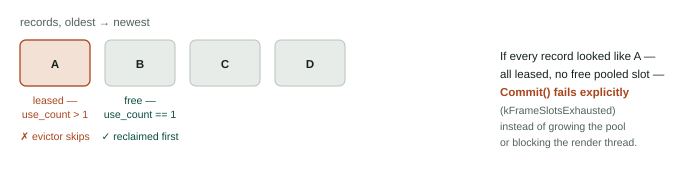
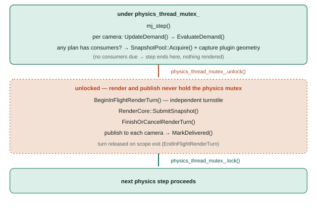
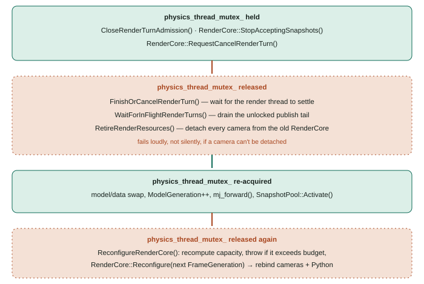

RenderCore
==========

RenderCore is the transport-neutral rendering seam: it turns a physics-step snapshot into leased, immutable frame planes that any number of consumers — ROS 1, ROS 2, Python — can read without triggering a second render or blocking on each other. This page describes the mechanism in enough detail to extend it without breaking the ownership boundary: what RenderCore owns, what runs on which thread, and exactly how a reload and a render turn stay out of each other's way.

Ownership
---------

RenderCore owns:

* Camera descriptors and the render plan they produce (``rendering/camera_descriptor.hpp``, ``rendering/render_demand.hpp``).
* The render backend and its thread affinity (``rendering/render_backend_interface.hpp``).
* Copied render snapshots (``rendering/render_snapshot.hpp``).
* Frame storage, leases, and generations (``rendering/frame_boundary.hpp``).

RenderCore does **not** own ``MujocoEnv``, ROS nodes or message types, or transport timestamps. Those stay with ``MujocoEnv`` and the transport adapters (``OffscreenCamera`` for ROS, ``CameraPublicationTransport`` for Python) described at the end of this page.

Capacity is a budget decided up front
--------------------------------------

A ``RenderCore`` is constructed with a fixed ``max_slots``/``max_bytes`` ceiling that never grows for the lifetime of that instance. Before any camera set is accepted, ``ReconfigureRenderCore`` (on ``MujocoEnv``) computes exactly how many slots and bytes the configured cameras and any registered Python history depth actually need — ``ComputeFrameSlotCapacity``, ``ComputeFrameByteCapacity``, ``ComputeWarmSlotCount`` in ``rendering/frame_capacity.hpp`` — using overflow-checked arithmetic, and throws before touching ``RenderCore`` at all if that requirement exceeds the fixed budget. Capacity failure is therefore a configuration-time error, not something discovered mid-render.

The frame store: ``FrameBoundary``, ``FrameWriter``, ``FrameLease``
---------------------------------------------------------------------

``FrameBoundary`` preallocates ``max_slots`` storage objects once, at construction, and never allocates a new one afterward. Writing and reading against that fixed pool works like this:

* ``TryAcquireWriter(generation, plane, layout)`` reserves one slot's worth of capacity and hands back a ``FrameWriter`` with a scratch byte buffer to fill. The reservation is accounted separately from committed storage (``reserved_slots``/``reserved_bytes`` vs. ``committed_bytes``) so two writers can be in flight without either overcommitting the budget.
* ``FrameWriter::Commit()`` is the only thing that makes a frame visible: it swaps the scratch bytes into a pooled ``Storage`` slot, stamps it with a ``FrameStamp`` (capture id, camera id, a per-plane monotonically increasing ``plane_sequence``, the model and frame generation, and the simulation timestamp), and appends it to ``records``.
* A ``FrameWriter`` that is destroyed without being committed releases its reservation automatically. An exception thrown while filling the buffer — or a stale-generation/capacity rejection returned by ``TryAcquireWriter`` itself — can never leak a permanently reserved slot.
* A ``FrameLease`` is a ``shared_ptr<const Storage>``. Any number of leases can point at the same committed frame; the frame's storage is kept alive by that reference count, independent of whatever ``FrameBoundary`` itself is doing.

When ``Commit()`` needs a free pooled slot and none is marked free, it calls ``EvictOldestUnleasedRecord``, which scans ``records`` oldest-first and reclaims the first one whose ``use_count() == 1`` — meaning nothing outside ``FrameBoundary`` still holds a lease on it. A record that a consumer is still leasing is structurally unreachable to the evictor; if every record is currently leased and no pooled slot is free, the commit fails explicitly with ``kFrameSlotsExhausted`` rather than growing the pool or blocking the render thread.

 pool.
   :width: 100%

   Eviction only ever reclaims an unleased record, oldest-first. A frame a consumer still holds is structurally unreachable to the evictor.

Render backpressure is explicit
--------------------------------

``RenderBackpressurePolicy`` defaults to ``kDrop`` (``drop``). If a capture
cannot obtain a bounded slot, the render turn reports ``kFrameSlotsExhausted``
and the render thread remains non-blocking. The opt-in ``kWaitForSlot``
(``wait_for_slot``) policy moves the wait to the physics-side submission path,
after ``physics_thread_mutex_`` is released. A lease release wakes the wait.
Cancellation, reload, shutdown, and a policy change back to ``drop`` wake it
with an explicit stopped status. The pool never grows and existing leases are
never invalidated.

Generation staleness is checked twice
---------------------------------------

A render turn's generation is checked once when it is *queued* (``RenderCore::SubmitSnapshot`` compares the snapshot's ``ModelGeneration`` and the plan's ``FrameGeneration`` against current state) and again when the render thread actually *picks it up* (``RenderLoop`` recomputes ``stale_turn`` against the live ``configuration_``). The second check exists because ``Reconfigure()`` can run and supersede an already-queued turn before the render thread gets to it. A stale turn is dropped without ever touching the graphics backend.

``SnapshotPool``: decoupling the physics thread from the render thread
--------------------------------------------------------------------------

``RenderSnapshot`` carries a ``shared_ptr<mjData>`` that is a *copy*, never the live simulation's own ``mjData``. That copy comes from ``SnapshotPool``, which holds exactly two ``mjData`` slots per active ``ModelGeneration``:

* ``Activate(model, generation)`` allocates both slots (``mj_makeData``) when a model finishes loading; ``Deactivate()`` frees them.
* ``Acquire(model, source, generation)`` runs on the physics thread, right after ``mj_step``. It rejects immediately if the requested generation isn't the active one, and otherwise ``mj_copyData``s into whichever of the two slots is currently free.
* The returned ``shared_ptr<mjData>`` carries a deleter that flips its slot back to free — a caller never has to remember to release it explicitly.
* If both slots are already leased — for example, a slow previous render turn is still holding one — ``Acquire`` returns ``kExhausted`` immediately. The physics step drops that capture rather than blocking or growing the pool.

This is the only place where simulation state crosses from the physics thread into rendering: everything downstream of ``Acquire`` (plugin geometry included — see below) works off an owned copy, never a live pointer.

``DemandScheduler``: deciding whether to render at all
---------------------------------------------------------

Each registered consumer is one of three modes:

* **Cadenced** — due once its registered interval has elapsed since its last delivery.
* **One-shot** — due only after an explicit ``RequestOneShot``, and not due again until requested again.
* **Continuous** — always due while enabled.

``Evaluate(simulation_time, camera)`` walks consumers in a fixed, id-sorted order and returns a ``RenderPlan`` whose ``consumers`` list is exactly the ones due right now for that camera. An empty list is a valid outcome: ``RenderCore::SubmitSnapshot`` treats a plan with no consumers as a no-op success, so a camera nobody is watching costs nothing beyond the demand check itself — no render, no snapshot copy for that camera. ``MarkDelivered`` is the only thing that advances a cadenced consumer's clock or clears a one-shot flag; a consumer that is never marked delivered stays due indefinitely.

The render backend and thread affinity
-----------------------------------------

``IRenderBackend`` has exactly one thread it is ever called from: the ``std::thread`` that ``RenderCore`` starts for itself and joins in ``Shutdown()``. ``Initialize``, ``Resize``, ``Render``, and ``ShutdownOnRenderThread`` all run there — no other code path creates or tears down a graphics context. The compiled backend is EGL or OSMesa (selected at build time); there is no GLFW-backed offscreen backend, because GLFW's window/context lifetime calls are restricted to the process's main thread, which conflicts with RenderCore owning its own dedicated render thread. A disabled backend exists for builds without EGL/OSMesa support and reports every call as ``kBackendUnavailable``.

A render pass:

1. Updates the scene from the snapshot's model/data and the camera's visual options (``mjv_updateScene``).
2. Appends the plugin-contributed geometry — a plain ``vector<mjvGeom>`` already copied by the physics thread (see below) — directly into the scene's geometry buffer, failing loudly if it doesn't fit rather than silently truncating it.
3. Reads whichever planes were requested: RGB and segmentation share one color-read path with a scene flag toggle; depth is read as raw buffer values and converted to metric distance using *that model's* ``vis.map.znear``/``zfar`` and ``stat.extent`` — a per-model calibration, not a fixed constant.
4. Commits each plane through a ``FrameWriter`` as described above.

Plugins never receive a callback from the render thread. ``MujocoEnv`` collects plugin render geometry once, on the physics thread, into a scratch scene and copies the resulting geoms into a plain vector before handing it to ``RenderCore`` as part of the snapshot — the render thread only ever sees that already-captured copy.

At most one render turn in flight
-------------------------------------

A ``RenderCore`` holds at most one ``pending_turn_`` at a time. Submitting a second snapshot while one is already queued is rejected with ``kBusy`` rather than queued behind it. In steady-state stepping this rarely matters, because the physics step always waits for ``FinishOrCancelRenderTurn`` before it can submit again; it matters during recovery and reload paths, where it keeps RenderCore's state machine simple instead of needing an internal queue.

The physics-step pipeline
----------------------------

This is ``MujocoEnv::WrappedStep`` (``physics.cpp``), the actual per-step sequence:

he render turn, and publishing -- only reacquiring the physics mutex once that is done.
   :width: 75%

   Everything below the dashed line runs with ``physics_thread_mutex_`` released.

The physics mutex is released *before* the render/publish work starts, and only re-acquired once that work is done. Rendering and ROS publication can be slow — backend calls, subscriber-count checks, message construction — and holding ``physics_thread_mutex_`` across all of that would stall every other thread that needs it (control input, the viewer, plugin services) for the duration of one render. ``BeginInFlightRenderTurn``/``EndInFlightRenderTurn`` (an RAII guard backed by ``render_turn_mutex_`` and ``in_flight_render_turn_count_``) is a second, independent gate that exists specifically so reload can still know when it is safe to proceed, without needing the physics mutex held for that entire unlocked window.

How reload actually unwinds RenderCore
------------------------------------------

Continuing from the reload summary in :doc:`../overview/overview`, the RenderCore-specific part in the order it runs:

he model swap, mj_forward, and SnapshotPool activation. Release the physics mutex again for ReconfigureRenderCore, which recomputes capacity and reconfigures RenderCore for the new generation before rebinding cameras and Python consumers.
   :width: 100%

   ``RenderCore::Reconfigure`` internally waits for its own idle condition -- nothing queued or rendering -- before it swaps in the new camera set, so this step never races the render thread even though it runs outside the physics lock.

``RenderCore::Reconfigure`` is itself synchronized against the render thread: it waits on RenderCore's own idle condition until no turn is queued or rendering before it touches ``cameras_``, ``model_generation_``, or ``configuration_.generation``. Nothing about the old camera set or frame layout is visible again after this point — including to Python, which is checked separately below.

Fan-out to consumers
------------------------

**ROS.** Each camera owns a small dedicated worker thread (``BoundedPublicationQueue<PublicationItem>``, depth 2, latest-wins), so ``OffscreenCamera::PublishLatest`` only has to build the item and enqueue it — it never blocks the physics-step caller on a subscriber. A ``publication_sequence_`` counter, whose low bit doubles as a busy flag, lets a queued item detect — right before it actually publishes — whether the demand that produced it has already been superseded by newer demand; if so, the worker drops it instead of publishing something stale.

**Python.** ``CameraPublicationTransport`` remembers, per registration, exactly which ``RenderCore`` instance and which camera it was registered against. Every acquisition re-checks three independent things before handing back a lease:

1. ``ActiveRenderCore()`` is still the same instance the registration was made against — catches a full RenderCore replacement.
2. That instance's current ``FrameGeneration`` still matches what the registration observed — catches a reconfigure (new camera set / layout) on the *same* instance.
3. The lease actually returned still carries that same generation — a final check against the value, not just the counter.

Any mismatch raises rather than silently returning a leftover frame from a generation that no longer exists.

Failure taxonomy
--------------------

``RenderStatusCode`` (backend-facing) and ``FrameStatusCode`` (frame-boundary-facing) both distinguish an ordinary, expected miss — no consumer had demand, a plane wasn't available yet, a slot was momentarily exhausted, a generation was stale — from a context-integrity failure (``kBackendFailure``, ``kBackendUnavailable``, ``kTerminalError``). ``IsContextIntegrityFailure`` is the single predicate that draws that line. Only a context-integrity failure escalates into RenderCore's ``terminal_status_``, which then rejects every further submission until the backend is torn down and reinitialized. Frame leases already committed before a backend failure remain valid and readable — a broken backend does not retroactively invalidate frames a consumer is already holding.
