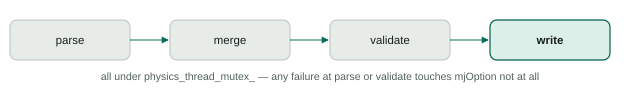

Runtime Options
================

Runtime Options is the single seam that validates and applies MuJoCo's runtime-tunable ``mjOption`` fields. ROS 1 and ROS 2 both translate transport requests into the same typed contract instead of parsing or mutating ``mjOption`` themselves.

Ownership
---------

Runtime Options owns the typed ``RuntimeOptionsSnapshot``/``RuntimeOptionsPatch`` contract (``runtime_options.hpp``), field validation, and the mapping to and from ``mjOption``. It does not own ``mjModel``, ``mjData``, or a persistent copy of the active options — ``ReadRuntimeOptions`` always reads back from the live model, so there is nothing to keep in sync.

The typed contract
-------------------

* ``RuntimeOptionsSnapshot`` is the complete set of fields — every option has a value.
* ``RuntimeOptionsPatch`` is the same fields, each wrapped in ``std::optional`` — a sparse set of changes.
* ``RuntimeOptionInput`` (``field`` name + a ``bool``/``int64``/``double``/``string`` variant) is the generic shape a transport adapter parses its own request into before handing it to ``ParseRuntimeOptionsPatch``.

Free functions do the actual work — ``ReadRuntimeOptions``, ``ParseRuntimeOptionsPatch``, ``ValidateRuntimeOptions``, ``MergeRuntimeOptions``, ``WriteRuntimeOptions`` — and are pure with respect to ``MujocoEnv``: they take and return values, and never reach into simulation state themselves.

The live-update transaction
--------------------------------

``MujocoEnv::ApplyRuntimeOptions`` is the one entry point live callers use, and it runs the same four steps every time, all under ``physics_thread_mutex_``:

   Four steps, always in this order, all under ``physics_thread_mutex_``.

Any failure at parsing or validation returns immediately with a ``RuntimeOptionsError`` and touches ``model_->opt`` not at all. Only a fully validated candidate is written, and it is written as one assignment (a complete ``mjOption`` built from the candidate, then assigned) followed by incrementing ``OptionsEpoch`` — there is no intermediate state where some fields are updated and others are not.

The admission-epoch guard
-----------------------------

Rejection during the loading window is guarded by two things, not one: the model lifecycle phase (must be ``kOperational``) and a separate ``runtime_options_admission_epoch_`` value that is read *before* ``physics_thread_mutex_`` is even acquired, then compared again once it is held. The second check exists for a specific race: a caller could observe "we're operational" an instant before a reload begins, then have to wait for ``physics_thread_mutex_`` for the entire duration of that reload, and finally acquire it right as the *new* generation becomes operational. Without the epoch check, that caller's patch — parsed and validated against intent formed before the reload — would silently land on a model it never actually observed. The epoch changing between the caller's initial read and its eventual lock acquisition is what catches that.

The startup-only path
--------------------------

``SetPendingRuntimeOptions`` is a separate path with a much narrower admission window: it is only accepted while there is no model loaded at all yet (``ModelLifecyclePhase::kNoModel`` and ``model_ == nullptr``). It parses and validates the patch eagerly — merged against a bare default snapshot — so a malformed startup patch is rejected immediately rather than being queued and discovered later. A patch that passes this check is stored and applied inside model loading itself, as one more merge+validate+write pass against the freshly loaded model's real effective options.

The trade-off at that point is deliberate: if the startup patch fails validation against the *real* model (which can have different valid ranges than the default snapshot it was pre-checked against), the model load itself does not fail. The model stays valid and running with MuJoCo's own effective options, and the failure is only recorded through the existing load-error channel. A simulation that would otherwise be perfectly loadable is not held hostage by one bad tuning value.
